# Mohamed-Ali Masmoudi
**AI Product Engineer · Full-Stack TypeScript**

I build **practical AI products** and **scalable SaaS** with a strong focus on production quality.

**Strengths:** product-minded engineering · fast iteration · reliable systems

---

## Projects
- **Ductize** — productized services platform
- **Scenay** — AI product photography
- **Collective Goals** — accountability app
- **i18n-mcp** — MCP server for translation workflows

---

## Metrics

![Metrics](https://metrics.lecoq.io/dalisys?template=classic&languages=1&isocalendar=1&repositories=1&introduction=1&lines=1&habits=1&base=header%2C%20activity%2C%20community%2C%20repositories%2C%20metadata&base.indepth=false&base.hireable=false&base.skip=false&repositories.batch=100&repositories.forks=false&repositories.affiliations=owner&isocalendar=false&isocalendar.duration=half-year&languages=false&languages.limit=8&languages.threshold=0%25&languages.other=false&languages.colors=github&languages.sections=most-used&languages.indepth=false&languages.analysis.timeout=15&languages.analysis.timeout.repositories=7.5&languages.categories=markup%2C%20programming&languages.recent.categories=markup%2C%20programming&languages.recent.load=300&languages.recent.days=14&lines=false&lines.sections=base&lines.repositories.limit=4&lines.history.limit=1&lines.delay=0&habits=false&habits.from=200&habits.days=14&habits.facts=true&habits.charts=false&habits.charts.type=classic&habits.trim=false&habits.languages.limit=8&habits.languages.threshold=0%25&repositories=false&repositories.pinned=0&repositories.starred=0&repositories.random=0&repositories.order=featured%2C%20pinned%2C%20starred%2C%20random&introduction=false&introduction.title=true&config.timezone=Europe%2FBerlin)
---

## Contact
- 🌐 Website: https://masmoudi.dev
- 💼 LinkedIn: https://www.linkedin.com/in/dali-masmoudi
- ✉️ Email: contact@masmoudi.dev
